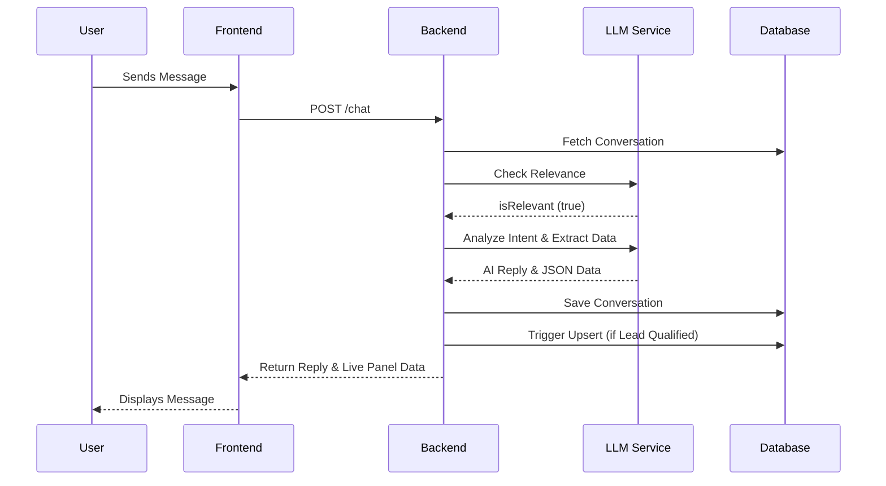
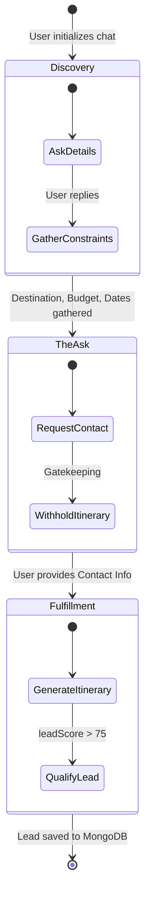
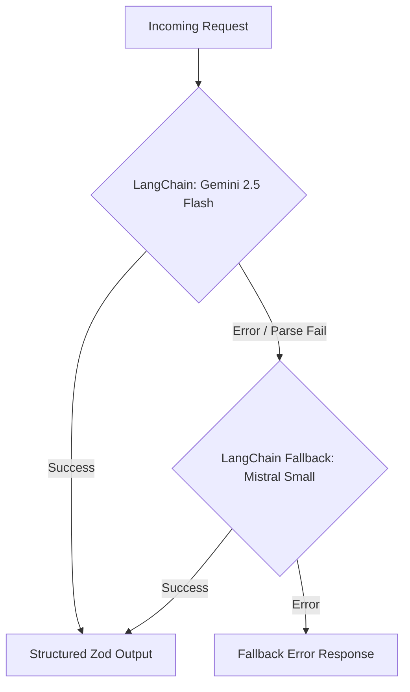

# AI Travel Lead Generation Assistant

An AI-powered travel planning assistant designed strictly for **lead generation**. It engages users in natural conversations to plan their trips while quietly extracting structured data (travel requirements, budget, contact info) to qualify high-intent sales leads.

**Tech Stack:** React (Frontend) | Node.js/Express (Backend) | MongoDB | LangChain | Google Gemini (Primary) | Mistral AI (Fallback)

---

## 🌊 Request Flow Architecture

The system is built to maintain context efficiently while extracting real-time JSON data from natural conversation.



### Flow Breakdown

1. **Chat Init:** User opens UI; frontend calls backend to generate a session ID (`localStorage`).
2. **Relevance Guardrail:** Backend verifies the message is travel-related before processing.
3. **Context Management:** Older messages are compressed into a "rolling summary" to minimize token costs.
4. **Data Extraction:** LangChain (`zod` schemas) analyzes the prompt, returning a conversational reply + strictly typed JSON data.
5. **Lead Check:** If the AI scores the user high enough (with contact info), a permanent lead is created.
6. **Live UI Sync:** Frontend displays the chat and updates the real-time "Extraction Panel".

---

## 🎯 The Lead Generation Funnel

The system prompt engineers the LLM into a specific sales funnel, acting as a conversational gatekeeper.



### Funnel Stages

* **Discovery (Hook):** Enthusiastically helps plan the trip, requesting constraints (budget, dates).
* **The Ask (Gatekeeper):** Pauses before generating the final itinerary to ask for a name and phone number (to "send a personalized link").
* **Fulfillment:** Once contact info is provided, the AI delivers the itinerary and boosts the user's lead score.

> **Database Trigger Rule:** A lead is only upserted to the MongoDB `leads` collection if `leadScore > 75` **AND** the user has provided an email or phone number.

---

## 🚏 Backend API Routing (`server/routes/chat.js`)

| Method | Endpoint | Core Function |
| --- | --- | --- |
| **POST** | `/initiate-chat` | Starts session. Generates `uuid` and creates an empty conversation document in MongoDB. |
| **POST** | `/chat` | **The Core Engine.** Runs relevance checks, manages sliding context, extracts data via LLM, saves state, and evaluates lead triggers. |
| **GET** | `/conversation/:id` | **Hydration.** Fetches chat history and extracted data state on page reload to perfectly restore the UI. |

---

## 🧠 LLM Service (`server/services/llmService.js`)

The service utilizes **LangChain** with `.withFallbacks()`. If Gemini hits a rate limit, throws an error, or fails schema parsing, LangChain automatically retries the prompt with Mistral AI.



### Core Functions

* **`checkTravelRelevance`**: Anti-prompt-injection guardrail. Returns a strict boolean to ensure the AI only discusses travel.
* **`summarizeMessages`**: Compresses evicted conversational turns into a cohesive string, keeping token usage low without losing historical context.
* **`analyzeTravelIntent`**: The heavy lifter. Uses `.withStructuredOutput()` to simultaneously output a natural `reply` and an `extractedData` JSON object containing constraints, contact info, and the calculated `leadScore`.

```

```